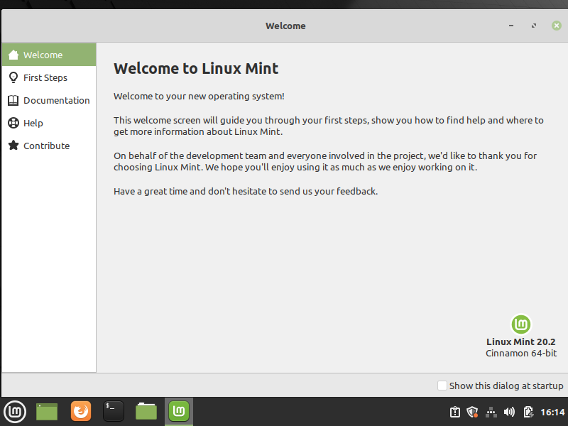

# Pre-configuration operating system

## Linux Mint 20.2

### Guest additions and shared folder: steps 1 --> 5

=== "Step1"

    Move the "Welcome" window a bit. Toggle option "Show this dialog at startup" and close that window.

    <kbd>  </kbd>

=== "Step2"

    <kbd>  </kbd>

=== "Step3"

    <kbd>  </kbd>

=== "Step4"

    <kbd>  </kbd>

=== "Step5"

    <kbd>  </kbd>

### Guest additions and shared folder: steps 6 --> 11

=== "Step6"

    <kbd>  </kbd>

=== "Step7"

    <kbd>  </kbd>

=== "Step8"

    <kbd>  </kbd>

=== "Step9"

    <kbd>  </kbd>

=== "Step10"

    <kbd>  </kbd>

=== "Step11"

    <kbd>  </kbd>

## Debian 11.2

No pre-configuration here.

## Rocky Linux 6.5

No pre-configuration here.