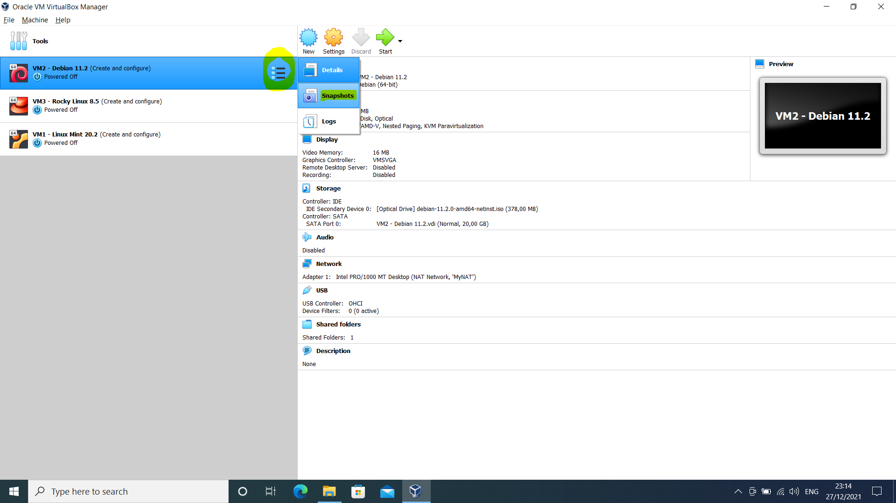
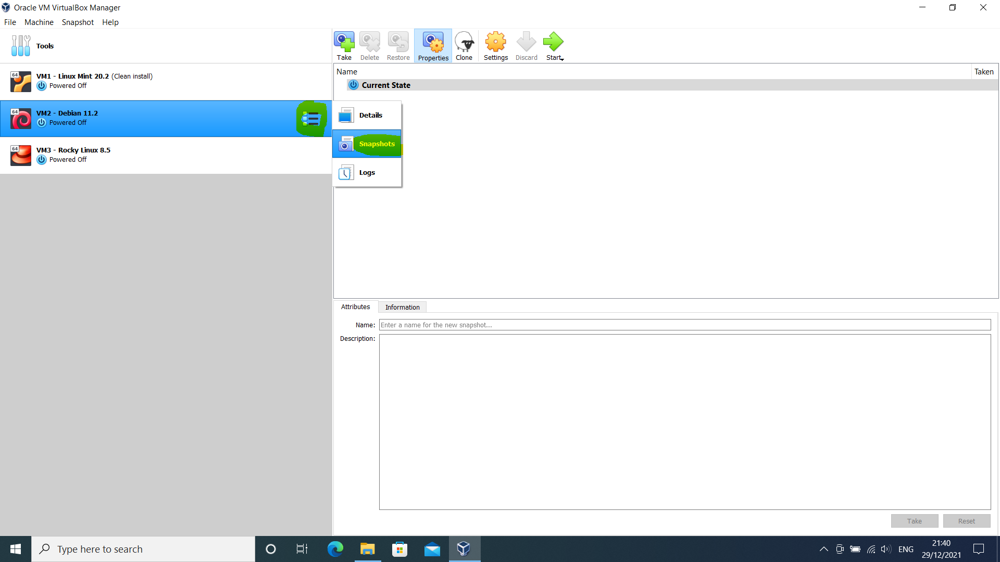
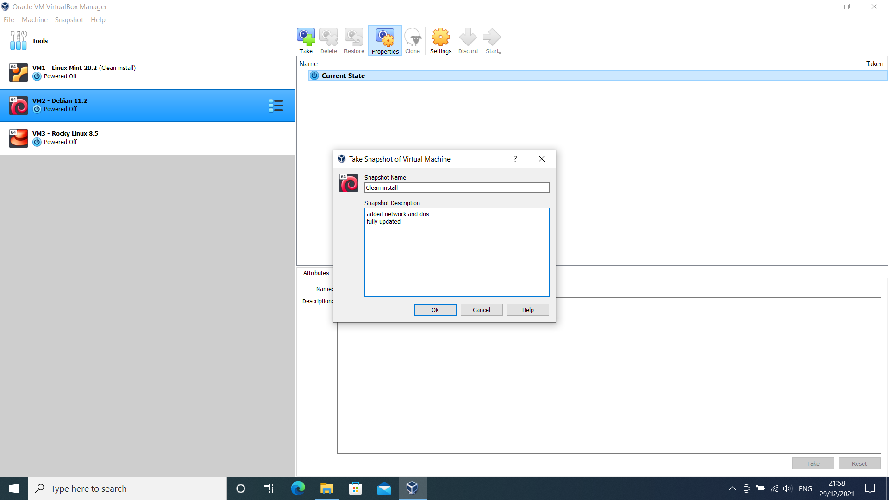
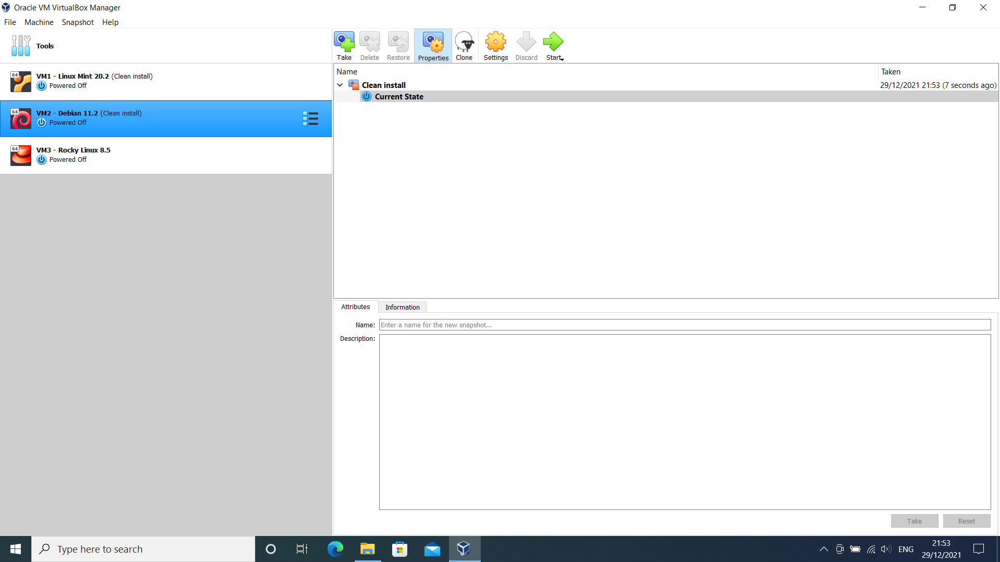
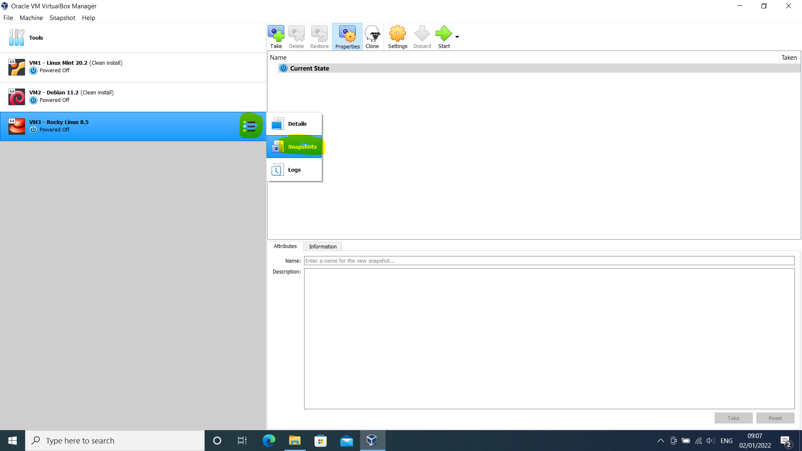
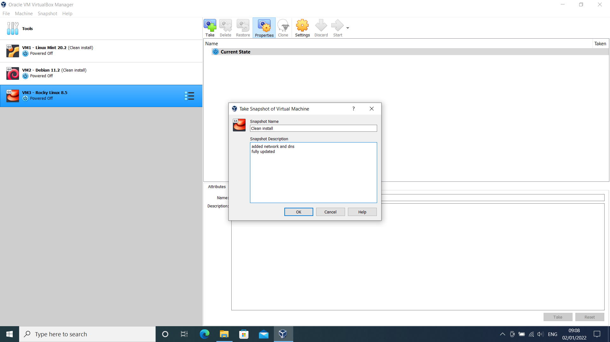
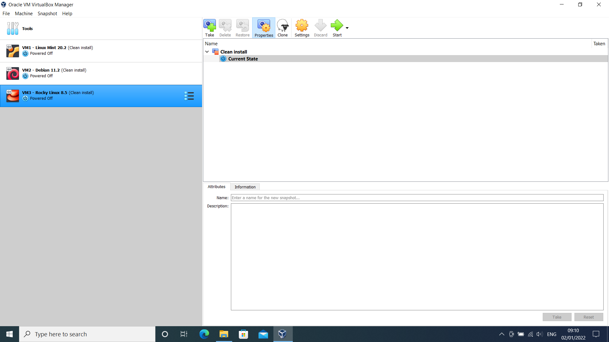

# Snapshot

## Linux Mint 20.X

### Steps 1 --> 3

=== "Step1"

    <kbd>  </kbd>

=== "Step2"

    <kbd>  </kbd>

=== "Step3"

    <kbd>  </kbd>

## Debian 11.X

### Steps 1 --> 3

=== "Step1"

    <kbd>  </kbd>

=== "Step2"

    <kbd>  </kbd>

=== "Step3"

    <kbd>  </kbd>

## Rocky Linux 8.X

### Steps 1 --> 3

=== "Step1"

    <kbd>  </kbd>

=== "Step2"

    <kbd>  </kbd>

=== "Step3"

    <kbd>  </kbd>