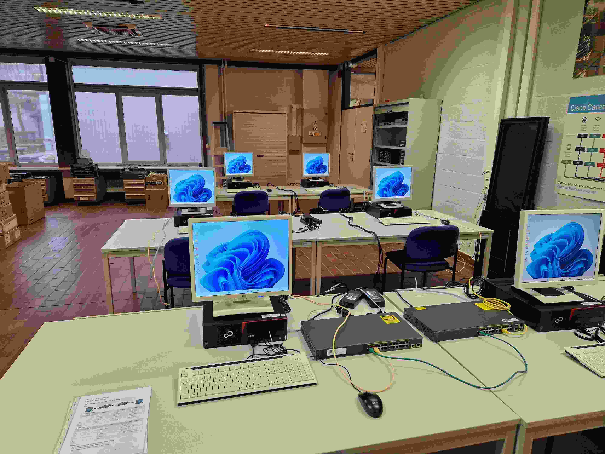
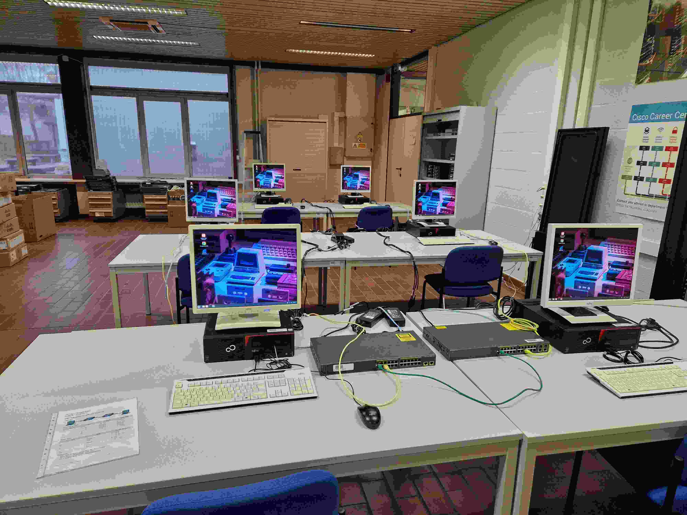
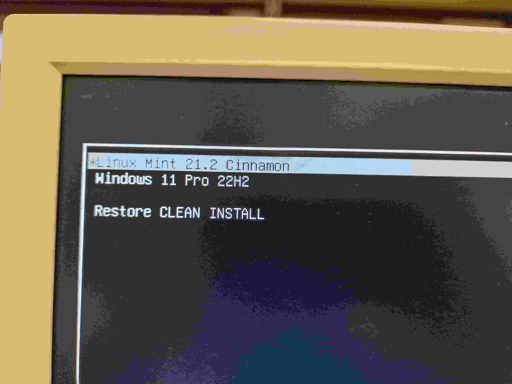
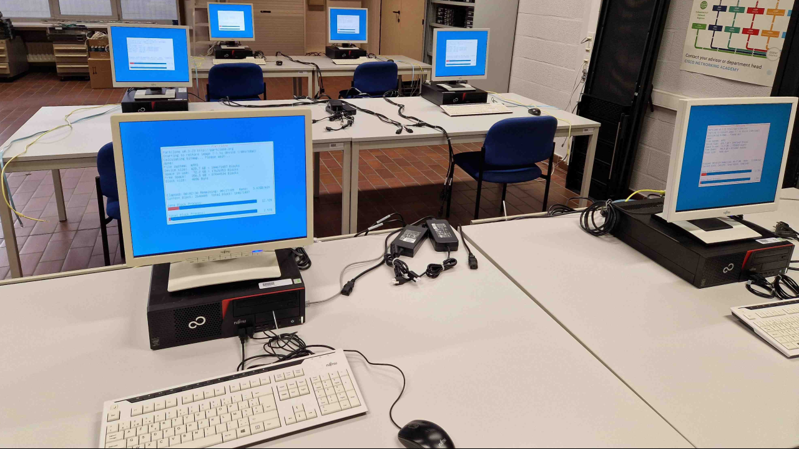
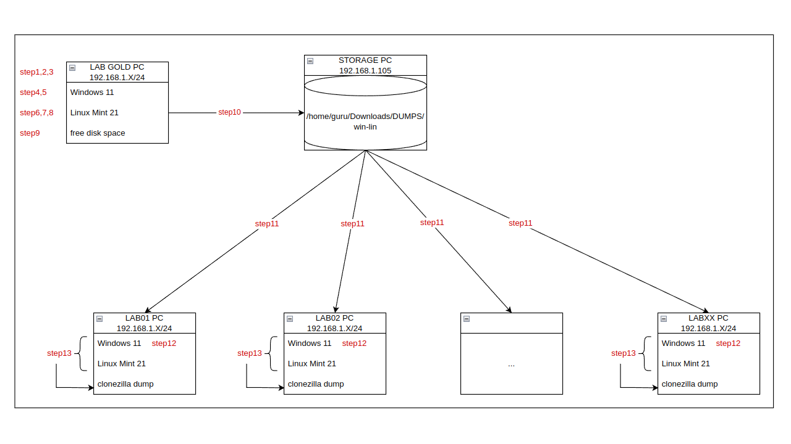

# Install a Windows 11 & Linux Mint 21 dual boot LAB-PC (BIOS) with local Clonezilla backup & restore
Cisco hands-on labs are a learning resource provided by Cisco Systems, a well-known networking and IT infrastructure company. These labs are designed to offer practical, real-world experience in working with Cisco networking equipment and technologies. They are particularly valuable for individuals preparing for Cisco certifications, such as Cisco's CCNA (Cisco Certified Network Associate) or CCNP (Cisco Certified Network Professional) exams, as well as for IT professionals who want to gain hands-on experience with Cisco products and solutions.

This tutorial guides you through the relevant steps that are required to initialise and install a physical LAB PC, with a local Clonezilla restore option.
You’ll go from an *empty computer* to to a fully configured *Windows/Linux dual-boot* environment.

Clonezilla is a free and open-source disk cloning and imaging software that allows you to create backup copies of entire disk drives or partitions. Done experimenting? System crash? Hardware failure? Malware infection? Recover your system in its entirety back to a clean state.

=== "Overview1"
    All Windows.

    

=== "Overview2"
    All Linux.

    

=== "Overview3"
    Choose your OS at the GRUB boot menu.

    

=== "Overview4"
    All restoring.

    

=== "Overview5"
    Workflow.

    

<!--- start comment
# Install a Windows 11 & Linux Mint 21 dual boot LAB PC with local clonezilla restore option (BIOS).

## About this tutorial
Let’s learn by example. This tutorial guides you through the relevant steps that are required to initialise and install a physical LAB PC, with a local Clonezilla restore option.
You’ll go from an *empty computer* to to a fully configured *Windows/Linux dual-boot* environment. A hands-on introduction to...

- preparing installation media
- configuring the BIOS/UEFI
- installing & configuring Windows 11
- installing & configuring Linux Mint 21
- configuring a local backup/restore option using Clonezilla

Make sure to also check out the [How-to guides](../../howtos/index.md) for instructions on how to achieve specific goals, as well as the [References](../../references/index.md) and [Explanations](../../explanations/index.md) sections for other helpful information.
-->